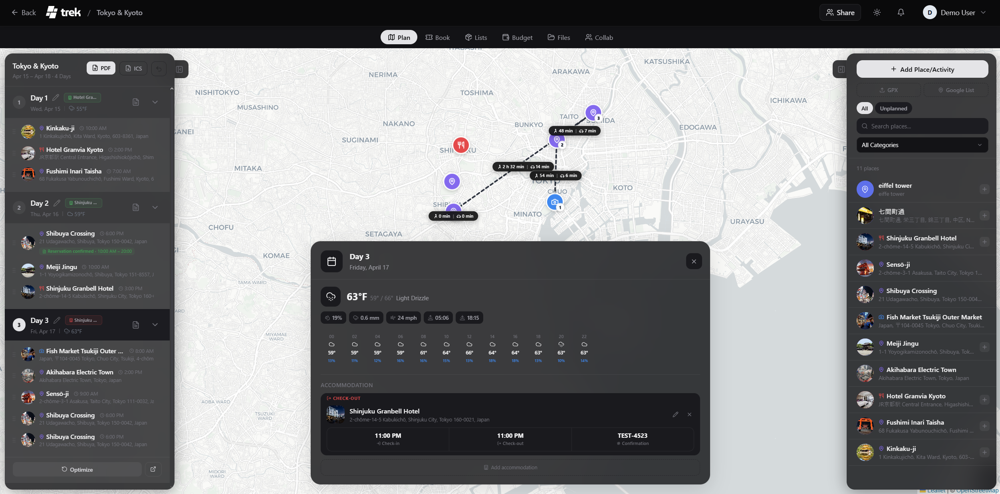
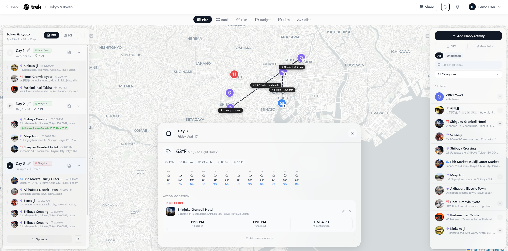
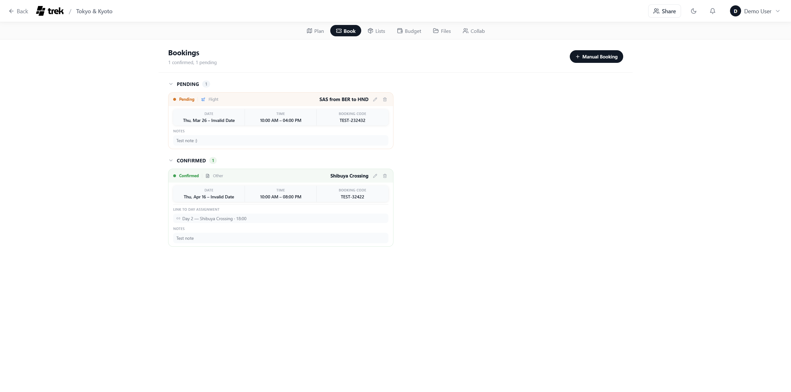
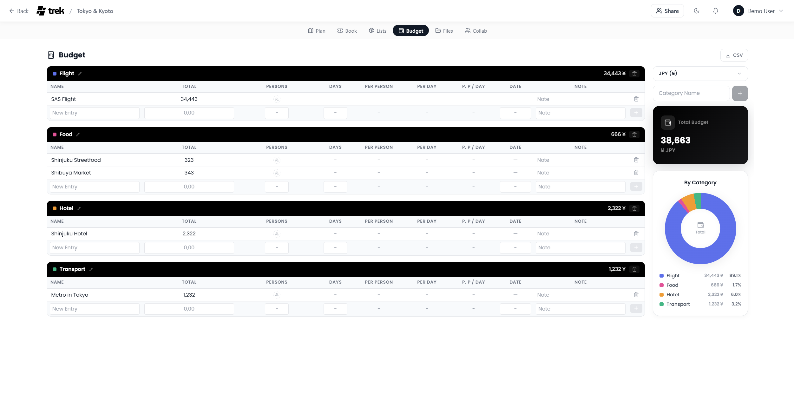
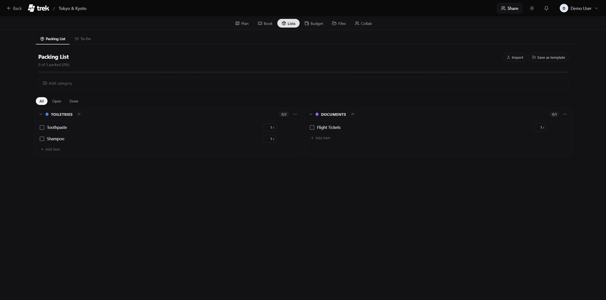

<p align="center">
  <picture>
    <source media="(prefers-color-scheme: dark)" srcset="client/public/logo-light.svg" />
    <source media="(prefers-color-scheme: light)" srcset="client/public/logo-dark.svg" />
    
  </picture>
  <br />
  <em>Your Trips. Your Plan.</em>
</p>

<p align="center">
  <a href="LICENSE"></a>
  <a href="https://github.com/mauriceboe/TREK"></a>
</p>

<p align="center">
  A self-hosted, real-time collaborative travel planner with interactive maps, budgets, packing lists, and more.
  <br />
  This fork adds <strong>Railway deployment</strong> support with S3 object storage for uploads.
  <br />
  <strong><a href="https://demo-nomad.pakulat.org">Live Demo</a></strong> (upstream) — Try TREK without installing. Resets hourly.
</p>




<details>
<summary>More Screenshots</summary>

|                                                 |                                              |
| ----------------------------------------------- | -------------------------------------------- |
|  |     |
|            |  |
|              |                                              |

</details>

## Features

### Trip Planning

- **Drag & Drop Planner** — Organize places into day plans with reordering and cross-day moves
- **Interactive Map** — Leaflet map with photo markers, clustering, route visualization, and customizable tile sources
- **Place Search** — Search via Google Places (with photos, ratings, opening hours) or OpenStreetMap (free, no API key needed)
- **Day Notes** — Add timestamped, icon-tagged notes to individual days with drag & drop reordering
- **Route Optimization** — Auto-optimize place order and export to Google Maps
- **Weather Forecasts** — 16-day forecasts via Open-Meteo (no API key needed) with historical climate averages as fallback
- **Map Category Filter** — Filter places by category and see only matching pins on the map

### Travel Management

- **Reservations & Bookings** — Track flights, accommodations, restaurants with status, confirmation numbers, and file attachments
- **Budget Tracking** — Category-based expenses with pie chart, per-person/per-day splitting, and multi-currency support
- **Packing Lists** — Category-based checklists with user assignment, packing templates, and progress tracking
- **Packing Templates** — Create reusable packing templates in the admin panel with categories and items, apply to any trip
- **Bag Tracking** — Optional weight tracking and bag assignment for packing items with iOS-style weight distribution (admin-toggleable)
- **Document Manager** — Attach documents, tickets, and PDFs to trips, places, or reservations (up to 50 MB per file)
- **PDF Export** — Export complete trip plans as PDF with cover page, images, notes, and TREK branding

### Mobile & PWA

- **Progressive Web App** — Install on iOS and Android directly from the browser, no App Store needed
- **Offline Support** — Service Worker caches map tiles, API data, uploads, and static assets via Workbox
- **Native App Feel** — Fullscreen standalone mode, custom app icon, themed status bar, and splash screen
- **Touch Optimized** — Responsive design with mobile-specific layouts, touch-friendly controls, and safe area handling

### Collaboration

- **Real-Time Sync** — Plan together via WebSocket — changes appear instantly across all connected users
- **Multi-User** — Invite members to collaborate on shared trips with role-based access
- **Invite Links** — Create one-time registration links with configurable max uses and expiry for easy onboarding
- **Single Sign-On (OIDC)** — Login with Google, Apple, Authentik, Keycloak, or any OIDC provider
- **Two-Factor Authentication (MFA)** — TOTP-based 2FA with QR code setup, works with Google Authenticator, Authy, etc.
- **Collab** — Chat with your group, share notes, create polls, and track who's signed up for each day's activities

### Addons (modular, admin-toggleable)

- **Vacay** — Personal vacation day planner with calendar view, public holidays (100+ countries), company holidays, user fusion with live sync, and carry-over tracking
- **Atlas** — Interactive world map with visited countries, bucket list with planned travel dates, travel stats, continent breakdown, streak tracking, and liquid glass UI effects
- **Collab** — Chat with your group, share notes, create polls, and track who's signed up for each day's activities
- **Dashboard Widgets** — Currency converter and timezone clock, toggleable per user

### Customization & Admin

- **Dashboard Views** — Toggle between card grid and compact list view on the My Trips page
- **Dark Mode** — Full light and dark theme with dynamic status bar color matching
- **Multilingual** — English, German, Spanish, French, Russian, Chinese (Simplified), Dutch, Arabic (with RTL support)
- **Admin Panel** — User management, invite links, packing templates, global categories, addon management, API keys, backups, and GitHub release history
- **Auto-Backups** — Scheduled backups with configurable interval and retention
- **Customizable** — Temperature units, time format (12h/24h), map tile sources, default coordinates

## Tech Stack

- **Backend**: Node.js 22 + Express + SQLite (`better-sqlite3`)
- **Frontend**: React 18 + Vite + Tailwind CSS
- **PWA**: vite-plugin-pwa + Workbox
- **Real-Time**: WebSocket (`ws`)
- **State**: Zustand
- **Auth**: JWT + OIDC + TOTP (MFA)
- **Maps**: Leaflet + react-leaflet-cluster + Google Places API (optional)
- **Weather**: Open-Meteo API (free, no key required)
- **Icons**: lucide-react

## Deploy to Railway

This fork is configured for Railway deployment using **Object Storage** (S3-compatible) for uploads and a small **volume** for the SQLite database.

### 1. Create the service

- Connect this repo to a new Railway project (**New Project → Deploy from GitHub Repo**)
- Railway will detect `railway.toml` and build using `Dockerfile.railway`

### 2. Add Object Storage

- In your project, click **New → Database → Object Storage**
- Connect it to your TREK service
- Railway auto-injects the `AWS_*` environment variables

All user uploads (files, covers, avatars, photos) are stored in S3 object storage. This is cheaper, scalable, and not limited by volume size.

### 3. Add a volume (for SQLite only)

- In your service's **Settings → Volumes**, click **Add Volume**
- Set the mount path to `/app/storage`

The volume only stores the SQLite database and backup ZIPs — uploads go to object storage:

```
/app/storage/          ← Railway volume (small, database only)
└── data/
    ├── travel.db      ← SQLite database
    ├── backups/       ← backup ZIP files
    └── tmp/
```

### 4. Set environment variables

The S3 variables are auto-injected by Railway when you attach Object Storage. You only need to set:

| Variable          | Value                                                           | Required |
| ----------------- | --------------------------------------------------------------- | -------- |
| `JWT_SECRET`      | A random string (`openssl rand -hex 32`)                        | Yes      |
| `NODE_ENV`        | `production`                                                    | Yes      |
| `PORT`            | `3000`                                                          | Yes      |
| `ALLOWED_ORIGINS` | Your Railway URL, e.g. `https://trek-production.up.railway.app` | No       |

The following are auto-set by Railway Object Storage:

| Variable                | Description            |
| ----------------------- | ---------------------- |
| `AWS_ENDPOINT_URL`      | S3-compatible endpoint |
| `AWS_S3_BUCKET_NAME`    | Bucket name            |
| `AWS_DEFAULT_REGION`    | Region                 |
| `AWS_ACCESS_KEY_ID`     | Access key             |
| `AWS_SECRET_ACCESS_KEY` | Secret key             |

### 5. Deploy

Railway builds and deploys automatically. The first user to register becomes the admin.

### Migrating existing uploads to S3

If you have existing uploads on a volume, run the migration script as a one-off command:

```bash
node --import tsx src/services/migrateToS3.ts
```

This uploads all files from `/app/uploads` to S3. After verifying, the uploads directory on the volume can be removed.

### Install as App (PWA)

TREK works as a Progressive Web App — no App Store needed:

1. Open your TREK instance in the browser (HTTPS required)
2. **iOS**: Share button → "Add to Home Screen"
3. **Android**: Menu → "Install app" or "Add to Home Screen"
4. TREK launches fullscreen with its own icon, just like a native app

---

<details>
<summary>Docker Compose (alternative, non-Railway)</summary>

```yaml
services:
  app:
    image: mauriceboe/trek:latest
    container_name: trek
    ports:
      - "3000:3000"
    environment:
      - NODE_ENV=production
      - PORT=3000
      # - OIDC_ISSUER=https://auth.example.com
      # - OIDC_CLIENT_ID=trek
      # - OIDC_CLIENT_SECRET=supersecret
      # - OIDC_DISPLAY_NAME="SSO"
      # - OIDC_ONLY=true          # disable password auth entirely
    volumes:
      - ./data:/app/data
      - ./uploads:/app/uploads
    restart: unless-stopped
```

```bash
docker compose up -d
```

</details>

<details>
<summary>Docker Run</summary>

```bash
docker run -d -p 3000:3000 -v ./data:/app/data -v ./uploads:/app/uploads mauriceboe/trek
```

</details>

## Environment Variables

| Variable                | Description                | Default        |
| ----------------------- | -------------------------- | -------------- |
| `PORT`                  | Server port                | `3000`         |
| `NODE_ENV`              | Environment                | `production`   |
| `JWT_SECRET`            | JWT signing secret         | Auto-generated |
| `FORCE_HTTPS`           | Redirect HTTP to HTTPS     | `false`        |
| `OIDC_ISSUER`           | OIDC provider URL          | —              |
| `OIDC_CLIENT_ID`        | OIDC client ID             | —              |
| `OIDC_CLIENT_SECRET`    | OIDC client secret         | —              |
| `OIDC_DISPLAY_NAME`     | SSO button label           | `SSO`          |
| `OIDC_ONLY`             | Disable password auth      | `false`        |
| `TRUST_PROXY`           | Trust proxy headers        | `1`            |
| `DEMO_MODE`             | Enable demo mode           | `false`        |
| `AWS_ENDPOINT_URL`      | S3-compatible endpoint URL | —              |
| `AWS_S3_BUCKET_NAME`    | S3 bucket name             | —              |
| `AWS_DEFAULT_REGION`    | S3 region                  | `us-east-1`    |
| `AWS_ACCESS_KEY_ID`     | S3 access key              | —              |
| `AWS_SECRET_ACCESS_KEY` | S3 secret key              | —              |

## Optional API Keys

API keys are configured in the **Admin Panel** after login. Keys set by the admin are automatically shared with all users — no per-user configuration needed.

### Google Maps (Place Search & Photos)

1. Go to [Google Cloud Console](https://console.cloud.google.com/)
2. Create a project and enable the **Places API (New)**
3. Create an API key under Credentials
4. In TREK: Admin Panel → Settings → Google Maps

## Building from Source

```bash
git clone https://github.com/mauriceboe/TREK.git
cd TREK

# Standard Docker build
docker build -t trek .

# Railway-compatible build (single volume)
docker build -f Dockerfile.railway -t trek-railway .
```

## Data & Backups

- **Database**: SQLite, stored in `./data/travel.db` (on Railway volume at `/app/storage/data/`)
- **Uploads**: Stored in S3 object storage (Railway Object Storage or any S3-compatible provider)
- **Backups**: Create and restore via Admin Panel — backups include both the database and all uploads from S3, bundled into a single ZIP file
- **Auto-Backups**: Configurable schedule and retention in Admin Panel

## License

[AGPL-3.0](LICENSE)
